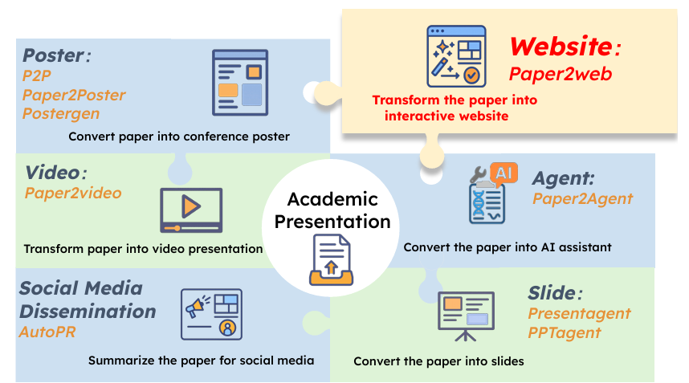

<p align="center">
<h1 align="center"> 🎉 PAPER2WEB: LET’S MAKE YOUR PAPER ALIVE! </h1>
</p>


## 📄🌐 Overview

Academic project websites can more effectively disseminate research when they clearly present core content and enable intuitive navigation and interaction. However, current approaches such as direct generation, templates, or direct HTML conversion struggle to produce layout-aware, interactive sites, and a comprehensive evaluation suite for this task has been lacking.

**PAPER2WEB** is an autonomous pipeline that converts scientific papers into explorable academic homepages. The agent iteratively refines both content and layout to create engaging, interactive websites that bring academic papers to life.

<p align="center">
    
</p>

## 🔥 News & Updates

- **[2025-10-18]** 🔥🔥 **Paper2ALL** released! Thanks to [**Paper2Video**](https://github.com/showlab/Paper2Video), [**Paper2Poster**](https://github.com/Paper2Poster/Paper2Poster) and [**AutoPR**](https://github.com/LightChen233/AutoPR), we have established a comprehensive pipeline for generating promotional materials for **Paper2ALL**.

- **[2025-10-18]** 📊 Paper2Web dataset and benchmark are currently under development. Stay tuned for comprehensive evaluation resources!

- **[2025-10-19]** 🎥 **Paper2Video** integration in progress! We are working to incorporate [**Paper2Video**](https://github.com/showlab/Paper2Video) into our unified pipeline for comprehensive academic presentation generation. Development ongoing

## 📋 Table of Contents

- [Installation](#installation)
- [Configuration](#configuration)
- [Quick Start](#quick-start)
- [Usage](#usage)
- [Evaluation](#evaluation)
- [Contributing](#contributing)


## 🚀 Installation

### Prerequisites

- Python 3.11 or higher
- Conda (recommended)
- LibreOffice
- Poppler-utils

### Step 1: Create Conda Environment

```bash
conda create -n p2w python=3.11
conda activate p2w
```

### Step 2: Install Dependencies

```bash
pip install -r requirements.txt
```

### Step 3: Install System Dependencies

**LibreOffice:**
```bash
sudo apt install libreoffice
```

*Alternative (without sudo):* Download LibreOffice from https://www.libreoffice.org/download/download-libreoffice/ and add to PATH.

**Poppler:**
```bash
conda install -c conda-forge poppler
```

## ⚙️ Configuration

Before running the code, configure your LLM API credentials.

### For All Components

Create a `.env` file in the project root:

```bash
# OpenAI API Configuration
OPENAI_API_KEY=your_openai_api_key_here
OPENAI_API_BASE=https://api.openai.com/v1

# Alternative: OpenRouter (recommended)
OPENAI_API_BASE=https://openrouter.ai/api/v1
OPENAI_API_KEY=sk-or-your-openrouter-key-here
```

### For AutoPR Component

```bash
cp AutoPR/.env.example AutoPR/.env
# Edit AutoPR/.env with your API credentials
```

### Optional: Google Search API (for logo search)

```bash
GOOGLE_SEARCH_API_KEY=your_google_search_api_key
GOOGLE_SEARCH_ENGINE_ID=your_search_engine_id
```

## 🏃‍♂️ Quick Start

### Input Directory Structure

The pipeline automatically detects the target platform based on folder names:

```
papers/
├── 12345/                    # Numeric → Twitter (English)
│   └── paper.pdf
└── research_project/         # Alphanumeric → Xiaohongshu (Chinese)
    └── paper.pdf
```

### Basic Usage

**Run all modules (automatic PDF detection):**
```bash
python pipeline_all.py --input-dir "path/to/papers" --output-dir "path/to/output"
```

**Run all modules with specific PDF:**
```bash
python pipeline_all.py --input-dir "path/to/papers" --output-dir "path/to/output" --pdf-path "path/to/paper.pdf"
```

**Website generation only:**
```bash
python pipeline_all.py --input-dir "path/to/papers" --output-dir "path/to/output" --model-choice 1
```

**Poster generation only (default 48x36 inches):**
```bash
python pipeline_all.py --input-dir "path/to/papers" --output-dir "path/to/output" --model-choice 2
```

**Poster generation with custom size:**
```bash
python pipeline_all.py --input-dir "path/to/papers" --output-dir "path/to/output" --model-choice 2 --poster-width-inches 60 --poster-height-inches 40
```

**PR material generation only:**
```bash
python pipeline_all.py --input-dir "path/to/papers" --output-dir "path/to/output" --model-choice 3
```

<!-- ## 🔧 Advanced Usage

### Evaluation Pipeline

**Generate QA pairs:**
```bash
python create_paper_questions.py --paper_folder "path/to/paper" --model_name o3
```

**Run comprehensive evaluation:**
```bash
python run_all_evaluations.py --paper_name "Paper Title" --base_dir "path/to/papers" --judge_version "v2" --auto_generate_qa
```

**Individual evaluation metrics:**
```bash
python eval_website_pipeline.py --paper_name "Paper Title" --base_dir "path/to/papers" --judge_version "v2" --metric informative_judge
python eval_website_pipeline.py --paper_name "Paper Title" --base_dir "path/to/papers" --judge_version "v2" --metric qa
python eval_website_pipeline.py --paper_name "Paper Title" --base_dir "path/to/papers" --judge_version "v2" --metric aesthetic_judge
```

### Supported Evaluation Metrics

- `informative_judge`: Information quality assessment
- `aesthetic_judge`: Visual design evaluation
- `qa`: Question-answering accuracy
- `completeness_llm`: Content completeness
- `connectivity_llm`: Navigation structure
- `interactivity_judge`: Interactive features

## 📊 Evaluation

The system includes comprehensive evaluation tools:

### Automatic Evaluation
```bash
# Generate QA pairs for evaluation
python create_paper_questions.py --paper_folder "path/to/paper"

# Run all evaluations
python run_all_evaluations.py --paper_name "Paper Title" --base_dir "path/to/papers" --judge_version "v2" --auto_generate_qa
```

### Manual Evaluation
```bash
# Individual metric evaluation
python eval_website_pipeline.py --paper_name "Paper Title" --base_dir "path/to/papers" --judge_version "v2" --metric informative_judge -->
```

## 🤝 Contributing

We welcome contributions! Please see our [Contributing Guide](CONTRIBUTING.md) for details.

1. Fork the repository
2. Create a feature branch
3. Make your changes
4. Add tests if applicable
5. Submit a pull request


## 🙏 Acknowledgments

- Thanks to the open-source community for the amazing tools and libraries
- Special thanks to contributors and users of the Paper2AI ecosystem
- Grateful to the [**Paper2Video**](https://github.com/showlab/Paper2Video)， [**Paper2Poster**](https://github.com/Paper2Poster/Paper2Poster) and [**AutoPR**](https://github.com/LightChen233/AutoPR) teams for their excellent work in academic presentation generation and PR material creation


<p align="center">
    <strong>⭐ If you find this project helpful, please give it a star!</strong>
</p>
