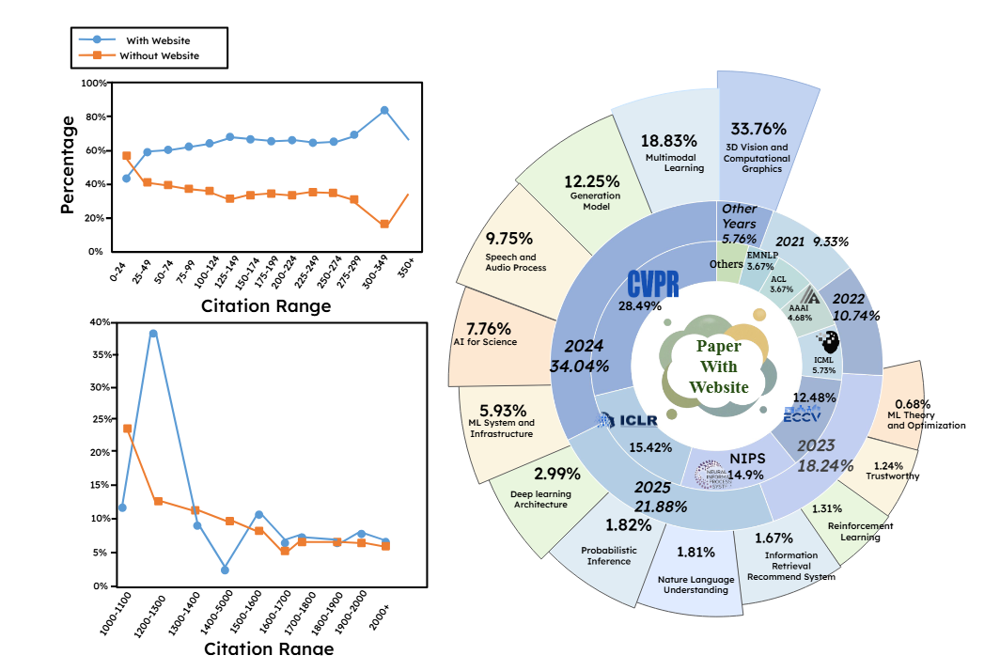

<p align="center">
<h1 align="center"> 🎉 PAPER2WEB: LET’S MAKE YOUR PAPER ALIVE! </h1>
</p>


## 📄🌐 Overview

Academic project websites can more effectively disseminate research when they clearly present core content and enable intuitive navigation and interaction. However, current approaches such as direct generation, templates, or direct HTML conversion struggle to produce layout-aware, interactive sites, and a comprehensive evaluation suite for this task has been lacking.

**PAPER2WEB** is an autonomous pipeline that converts scientific papers into explorable academic homepages. The agent iteratively refines both content and layout to create engaging, interactive websites that bring academic papers to life.

<p align="center">
    
</p>

## 🔥 News & Updates

- **[2025-10-21]** 🔥🔥  We are thrilled to hear that [**EvoPresent**](https://github.com/eric-ai-lab/EvoPresent) will be integrated into our pipeline in the future. EvoPresent brings advanced aesthetic agents for academic presentations with self-improvement capabilities. Stay tuned for this exciting collaboration!
- 
- **[2025-10-21]** 📊 Paper2Web dataset and benchmark are currently uploaded. You can use the [benchmark](https://huggingface.co/datasets/FrancisChen1/Paper2Web_bench) to improve performance. **You can also use the [dataset](https://huggingface.co/datasets/FrancisChen1/Paper2Web) for structural analysis, preference analysis, or to survey past work with tens of thousands of carefully categorized data.** 

- **[2025-10-18]** 🔥🔥 **Paper2ALL** released! Thanks to [**Paper2Video**](https://github.com/showlab/Paper2Video), [**Paper2Poster**](https://github.com/Paper2Poster/Paper2Poster) and [**AutoPR**](https://github.com/LightChen233/AutoPR), we have established a comprehensive pipeline for generating promotional materials for **Paper2ALL**.


## 📋 Table of Contents

- [Overview](#-overview)
- [News & Updates](#-news--updates)
- [Installation](#installation)
- [Configuration](#configuration)
- [Quick Start](#quick-start)
- [Usage](#usage)
- [Data for Paper2Web](#data-for-paper2web)
- [Benchmark for Paper2Web](#benchmark-for-paper2web)
- [Evaluation](#evaluation)
- [Contributing](#contributing)
- [Acknowledgments](#acknowledgments)
- [Citation](#Citation)


## 🚀 Installation

### Prerequisites

- Python 3.11 or higher
- Conda (recommended)
- LibreOffice
- Poppler-utils

### Step 1: Create Conda Environment

```bash
conda create -n p2w python=3.11
conda activate p2w
```

### Step 2: Install Dependencies

```bash
pip install -r requirements.txt
```

### Step 3: Install System Dependencies

**LibreOffice:**
```bash
sudo apt install libreoffice
```

*Alternative (without sudo):* Download LibreOffice from https://www.libreoffice.org/download/download-libreoffice/ and add to PATH.

**Poppler:**
```bash
conda install -c conda-forge poppler
```


## ⚙️ Configuration

Before running the code, configure your LLM API credentials.

### For All Components

Create a `.env` file in the project root:

```bash
# OpenAI API Configuration
OPENAI_API_KEY=your_openai_api_key_here
OPENAI_API_BASE=https://api.openai.com/v1

# Alternative: OpenRouter (recommended)
OPENAI_API_BASE=https://openrouter.ai/api/v1
OPENAI_API_KEY=sk-or-your-openrouter-key-here
```

### For AutoPR Component

```bash
cp AutoPR/.env.example AutoPR/.env
# Edit AutoPR/.env with your API credentials
```

### Optional: Google Search API (for logo search)

```bash
GOOGLE_SEARCH_API_KEY=your_google_search_api_key
GOOGLE_SEARCH_ENGINE_ID=your_search_engine_id
```

## 🏃‍♂️ Quick Start

### Input Directory Structure

The pipeline automatically detects the target platform based on folder names:

```
papers/
├── 12345/                    # Numeric → Twitter (English)
│   └── paper.pdf
└── research_project/         # Alphanumeric → Xiaohongshu (Chinese)
    └── paper.pdf
```

### Basic Usage

**Run all modules (automatic PDF detection):**
```bash
python pipeline_all.py --input-dir "path/to/papers" --output-dir "path/to/output"
```

**Run all modules with specific PDF:**
```bash
python pipeline_all.py --input-dir "path/to/papers" --output-dir "path/to/output" --pdf-path "path/to/paper.pdf"
```

**Website generation only:**
```bash
python pipeline_all.py --input-dir "path/to/papers" --output-dir "path/to/output" --model-choice 1
```

**Poster generation only (default 48x36 inches):**
```bash
python pipeline_all.py --input-dir "path/to/papers" --output-dir "path/to/output" --model-choice 2
```

**Poster generation with custom size:**
```bash
python pipeline_all.py --input-dir "path/to/papers" --output-dir "path/to/output" --model-choice 2 --poster-width-inches 60 --poster-height-inches 40
```

**PR material generation only:**
```bash
python pipeline_all.py --input-dir "path/to/papers" --output-dir "path/to/output" --model-choice 3
```

### Paper2Video
#### 1. Requirements
Prepare the environment:
```bash
cd paper2all/Paper2Video/src
conda create -n p2v python=3.10
conda activate p2v
pip install -r requirements.txt
conda install -c conda-forge tectonic ffmpeg poppler
```
**[Optional] [Skip](####2-configure-llms) this part if you do not need a human presenter.**

You need to **prepare the environment separately for talking-head generation** to potential avoide package conflicts, please refer to  <a href="git clone https://github.com/fudan-generative-vision/hallo2.git">Hallo2</a>. After installing, use `which python` to get the python environment path.
```bash
cd hallo2
conda create -n hallo python=3.10
conda activate hallo
pip install torch==2.2.2 torchvision==0.17.2 torchaudio==2.2.2 --index-url https://download.pytorch.org/whl/cu118
pip install -r requirements.txt
huggingface-cli download fudan-generative-ai/hallo2 --local-dir ../pretrained_models
```
Once you have installed hallo2, the --talking_head_env argument should point to the Python environment where hallo2 is installed. You can find the path to your hallo2 environment by running the following command:
```bash
which python
```
This will give you the path to the Python executable used by hallo2. You should use this path in the --talking_head_env argument in the pipeline.

#### 2. Inference
The script `pipeline.py` provides an automated pipeline for generating academic presentation videos. It takes **LaTeX paper sources** together with **reference image/audio** as input, and goes through multiple sub-modules (Slides → Subtitles → Speech → Cursor → Talking Head) to produce a complete presentation video. ⚡ The minimum recommended GPU for running this pipeline is **NVIDIA A6000** with 48G.

#### Example Usage
Run the following command to launch a fast generation (**without talking-head generation**):
```bash
python pipeline_light.py \
    --model_name_t gpt-4.1 \
    --model_name_v gpt-4.1 \
    --result_dir /path/to/output \
    --paper_latex_root /path/to/latex_proj \
    --ref_img /path/to/ref_img.png \
    --ref_audio /path/to/ref_audio.wav \
    --gpu_list [0,1,2,3,4,5,6,7]
```

Run the following command to launch a full generation (**with talking-head generation**):

```bash
python pipeline.py \
    --model_name_t gpt-4.1 \
    --model_name_v gpt-4.1 \
    --model_name_talking hallo2 \
    --result_dir /path/to/output \
    --paper_latex_root /path/to/latex_proj \
    --ref_img /path/to/ref_img.png \
    --ref_audio /path/to/ref_audio.wav \
    --talking_head_env /path/to/hallo2_env \
    --gpu_list [0,1,2,3,4,5,6,7]
```

## Data for Paper2Web

See [**here**](https://huggingface.co/datasets/FrancisChen1/Paper2Web) to view our curated dataset, which contains metadata and categories of papers with and without project websites, along with citation counts. This dataset can be used for analyzing website preferences and trends, as well as for current hot topics and paper research materials!

Please note that our pipeline as shown, we defines papers without project websites as those that have neither a dedicated project homepage nor a GitHub repository with a homepage link.

 We categorize these papers into 13 categories:
- 3D Vision and Computational Graphics
- Multimodal Learning
- Generation Model
- Speech and Audio Process
- AI for Science
- ML System and Infrastructure
- Deep learning Architecture
- Probabilistic Inference
- Nature Language Understanding
- Information Retrieval Recommend System
- Reinforcement Learning
- Trustworthy
- ML Theory and Optimization



## Benchmark for Paper2Web

See [**here**](https://huggingface.co/datasets/FrancisChen1/Paper2Web_bench) to get Paper2Web benchmark, including selected original website source code URLs, paper metadata, and partial results from PWAgent.


Below are some comparison examples showing the differences between original websites and PWAgent generated versions.


## 🔧Evaluate Paper2Web

### Evaluation Pipeline

**Generate QA pairs:**
```bash
python create_paper_questions.py --paper_folder "path/to/paper" --model_name o3
```

**Run comprehensive evaluation:**
```bash
python run_all_evaluations.py --paper_name "Paper Title" --base_dir "path/to/papers" --judge_version "v2" --auto_generate_qa
```

**Individual evaluation metrics:**
```bash
python eval_website_pipeline.py --paper_name "Paper Title" --base_dir "path/to/papers" --judge_version "path/to/dictionary/of/code" --metric informative_judge
```
```bash
python eval_website_pipeline.py --paper_name "Paper Title" --base_dir "path/to/papers" --judge_version "path/to/dictionary/of/code" --metric qa
```
```bash
python eval_website_pipeline.py --paper_name "Paper Title" --base_dir "path/to/papers" --judge_version "path/to/dictionary/of/code" --metric aesthetic_judge
```

### Supported Evaluation Metrics

- `informative_judge`: Information quality assessment
- `aesthetic_judge`: Visual design evaluation
- `qa`: Question-answering accuracy
- `completeness_llm`: Content completeness
- `connectivity_llm`: Navigation structure
- `interactivity_judge`: Interactive features

### Automatic Evaluation
```bash
# Generate QA pairs for evaluation
python create_paper_questions.py --paper_folder "path/to/paper"
```

```bash
# Run all evaluations
python run_all_evaluations.py --paper_name "Paper Title" --base_dir "path/to/papers" --judge_version "path/to/dictionary/of/code" --auto_generate_qa
```


## 🤝 Contributing

We welcome contributions! Please see our [Contributing Guide](CONTRIBUTING.md) for details.

1. Fork the repository
2. Create a feature branch
3. Make your changes
4. Add tests if applicable
5. Submit a pull request


## 🙏 Acknowledgments

- Thanks to the open-source community for the amazing tools and libraries
- Special thanks to contributors and users of the Paper2AI ecosystem
- Grateful to the [**Paper2Video**](https://github.com/showlab/Paper2Video)， [**Paper2Poster**](https://github.com/Paper2Poster/Paper2Poster), [**AutoPR**](https://github.com/LightChen233/AutoPR), and [**EvoPresent**](https://github.com/eric-ai-lab/EvoPresent) teams for their excellent work in academic presentation generation and PR material creation

## Citation
Please kindly cite our paper if you find this project helpful.

```bibtex
@misc{chen2025paper2webletsmakepaper,
      title={Paper2Web: Let's Make Your Paper Alive!}, 
      author={Yuhang Chen and Tianpeng Lv and Siyi Zhang and Yixiang Yin and Yao Wan and Philip S. Yu and Dongping Chen},
      year={2025},
      eprint={2510.15842},
      archivePrefix={arXiv},
      primaryClass={cs.CL},
      url={https://arxiv.org/abs/2510.15842}, 
}
```
<p align="center">
    <strong>⭐ If you find this project helpful, please give it a star!</strong>
</p>